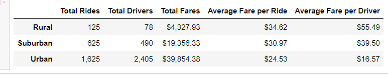
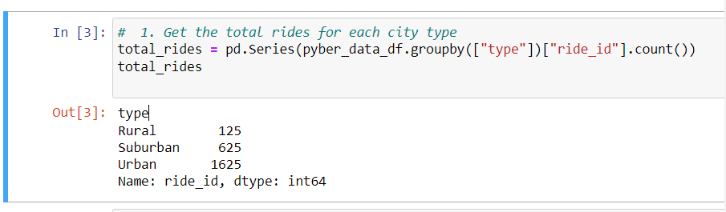
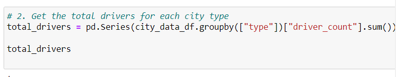
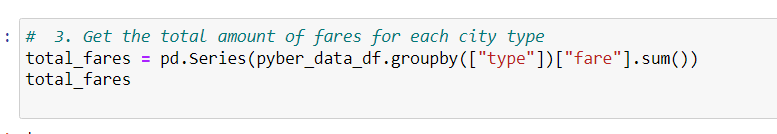
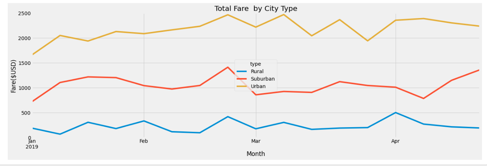

# PyBer_Analysis
## Overview
The purpose of this analysis was to sort through uber ride data and plot and showcase the trends among that data. We looked for trends in city types, and average pricing cost, and compared that with each city type.
## Results
After performing this analysis, the city type that had the most amount of drivers, rides, and total fares in USD was Urban, followed by Suburban, follwed by Rural with the least. The summary for this can be seen in the "Pyber Summary Statistics"

First we will talk about the total number of rides per city type. In the image below we see that Urban cities have the most, with 1,625, Suburban coming in second with 625 and Rural with 125. The "Total Rides" snapshot showcases how we are grabbing these numbers. 

Next, when we talk about total drivers we see 78 from Rural, 490 from Suburban city types, and 2,405 from Urban. The "Total Drivers" snapshot showcases how we calculate this.

Lastly, the total fares for each city type. We see 4,327 from Rural, 19,356.33 from Suburban and 39,854.38 from Urban. The "Total Fares" snapshot showcases how we calculate this.

Next we will look at the Average Fares per ride, and per driver. The lowest fare per ride (calculated by dividing the total fares/total rides) Rural had the largest cost per ride of 34.62, Suburban came in second with an average cost per ride of 30.97, and Urban came in with the cheapest cost per ride of 24.53. The average fare per driver can be mirrored to this dynamic as well, having Rural with the most expensive average fare of 55.49, Suburban with 39.50, and Urban with 16.57.
When analyzing the weekly fares per week we see  that the largest spike in total fares occurred between February and march for all three city types. However in Urban City types these trends continue until April. On the other end, we see a very large dip of total fares whenever there is a recent uptrend of prices. This fares to date comparison can be seen below in "Pyber Fare Summary".

## Summary
The first recommendation that I have for the CEO of pyber is related to the Urban communities. I would recommend having more drivers during the peak months of February and march, more drivers would mean more revenue.

For the Suburban communities i suggest less drivers in march, because the total revenue for that month and city type is lower than other months.

Because the amount of drivers is so low for the rural areas, i would suggest moving them to other communities during lower revenue months. The number of rides from Jan - April were much lower so it would make more sense to focus on the higher revenue months.
